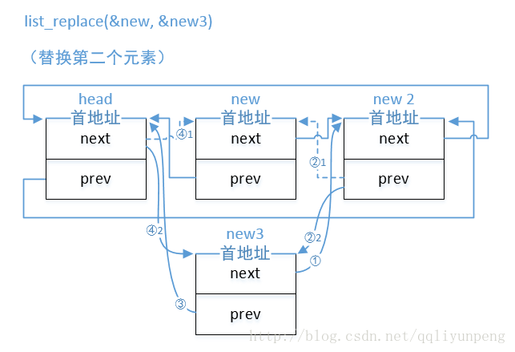

# list_head

    1. 链表数据结构 list_head 的定义

    在Linux内核中，提供了一个用来创建双向循环链表的结构 list_head。虽然linux内核是用C语言写
    的，但是list_head的引入，使得内核数据结构也可以拥有面向对象的特性，通过使用操作list_head
    的通用接口很容易实现代码的重用.

    定义在include/linux/types.h
    struct list_head {
        struct list_head *next, *prev;
    };

    需要注意的一点是，头结点head是不使用的，这点需要注意。
    使用list_head组织的链表的结构如下图所示：

    该结构没有数据域，所以一般被嵌到其它结构中，如：
    struct file_node{
　　    char c;
　　    struct list_head node;
    };

    2. 声明和初始化：有两种方法
    1)声明的时候初始化一个链表 LIST_HEAD 宏：

    // 链表的pre和next指针都指向了节点自己的首地址
    #define LIST_HEAD_INIT(name) { &(name), &(name) }

    #define LIST_HEAD(name) \
	       struct list_head name = LIST_HEAD_INIT(name)

    2)运行时初始化链表 INIT_LIST_HEAD 函数：
    static inline void INIT_LIST_HEAD(struct list_head *list)
    {
    	list->next = list;
    	list->prev = list;
    }

    初始化完效果如下图：

    3. 插入/删除/合并
    1)插入
    对链表的插入操作有两种：在表头插入list_add函数和在表尾插入list_add_tail函数
    list_add对应的是对stack的操作，而list_add_tail对应的是queue的操作

    // new：要添加的新的链表的首地址，head：链表的中的位置
    static inline void list_add(struct list_head *new, struct list_head *head)
    {
    	__list_add(new, head, head->next);
    }

    static inline void list_add_tail(struct list_head *new, struct list_head *head)
    {
    	__list_add(new, head->prev, head);
    }

    static inline void __list_add(struct list_head *new,
    			      struct list_head *prev,
    			      struct list_head *next)
    {
    	next->prev = new;
    	new->next = next;
    	new->prev = prev;
    	prev->next = new;
    }

    list_add示意图：

    list_add_tail示意图：

    

    2)删除
    对链表的删除操作函数有两种：list_del函数和list_del_init函数
    static inline void list_del(struct list_head *entry) // entry：要删除的链表的首地址
    {
    	__list_del(entry->prev, entry->next); // 这不就是 __list_del_entry(entry) 吗！！
    	entry->next = LIST_POISON1;
    	entry->prev = LIST_POISON2;
    }
    static inline void list_del_init(struct list_head *entry)
    {
    	__list_del_entry(entry);
    	INIT_LIST_HEAD(entry); // 运行中初始化链表节点
    }
    static inline void __list_del_entry(struct list_head *entry)
    {
    	__list_del(entry->prev, entry->next);
    }

    list_del函数中entry的next和prev指针指向了LIST_POISON1和LIST_POISON2位置，对他们进行
    访问都将引起页故障，保护不在链表中的节点项不可访问

    static inline void __list_del(struct list_head * prev, struct list_head * next)
    {
    	next->prev = prev;
    	prev->next = next;
    }

    3)替换
    对链表的替换操作有两个：list_replace函数和list_replace_init函数
    static inline void list_replace(struct list_head *old,
				struct list_head *new)
    {
    	new->next = old->next;
    	new->next->prev = new;
    	new->prev = old->prev;
    	new->prev->next = new;
    }

    static inline void list_replace_init(struct list_head *old,
    					struct list_head *new)
    {
    	list_replace(old, new);
    	INIT_LIST_HEAD(old);
    }

    4)搬移
    搬移的含义是将原本属于一个链表的节点移动到另一个链表的操作，有两个函数：list_move函数和
    list_move_tail函数：

    /**
     * list_move - 把从一个链表上删除的节点添加到另外的一个链表的头部
     * @list: 我们要移动的节点
     * @head: 要移动到的另外的一个链表头
     */
    static inline void list_move(struct list_head *list, struct list_head *head)
    {
    	__list_del_entry(list);
    	list_add(list, head);
    }

    5)合并
    合并在这里的意思就是合并了，是将两个独立的链表合并成为一个链表，合并的时候根据合并的位置的不同可以分为：
    合并到头部的 list_splice函数和合并到尾部的 list_splice_tail函数

    /**
     * list_splice - join two lists, this is designed for stacks
     * @list: the new list to add.
     * @head: the place to add it in the first list.
     */
    static inline void list_splice(const struct list_head *list,
    				struct list_head *head)
    {
    	if (!list_empty(list))
    		__list_splice(list, head, head->next);
    }
    /**
     * list_splice_tail - join two lists, each list being a queue
     * @list: the new list to add.
     * @head: the place to add it in the first list.
     */
    static inline void list_splice_tail(struct list_head *list,
    				struct list_head *head)
    {
    	if (!list_empty(list))
    		__list_splice(list, head->prev, head);
    }
    static inline void list_splice_init(struct list_head *list, // 推荐使用，防止混乱
    				    struct list_head *head)
    {
    	if (!list_empty(list)) {
    		__list_splice(list, head, head->next);
    		INIT_LIST_HEAD(list);                   <--- 跟list_splice唯一的不同
    	}
    }
    static inline void list_splice_tail_init(struct list_head *list, // 推荐使用，防止混乱
    					 struct list_head *head)
    {
    	if (!list_empty(list)) {
    		__list_splice(list, head->prev, head);
    		INIT_LIST_HEAD(list);                   <--- 跟list_splice_tail_init唯一的不同
    	}
    }
    static inline void __list_splice(const struct list_head *list,
    				 struct list_head *prev,
    				 struct list_head *next)
    {
    	struct list_head *first = list->next;
    	struct list_head *last = list->prev;

    	first->prev = prev;
    	prev->next = first;

    	last->next = next;
    	next->prev = last;
    }

    假设当前有两个链表，表头分别是list1和list2（都是struct list_head变量），当调
    用list_splice(&list1,&list2)时，只要list1非空，list1链表的内容将被挂接在list2链表上
    ，位于list2和list2.next（原list2表的第一个节点）之间。新list2链表将以原list1表的第一
    个节点为首节点，而尾节点不变。

    3. 查找
    list_entry函数：

    /**
     * list_entry - 获得含链表入口的结构体首地址
     * @ptr:	member的首地址
     * @type:	容器的类型
     * @member:	要得到他的容器的某个成员
     */
    #define list_entry(ptr, type, member) \
    	container_of(ptr, type, member)

    #define container_of(ptr, type, member) ({			\
    	const typeof( ((type *)0)->member ) *__mptr = (ptr);	\
    	(type *)( (char *)__mptr - offsetof(type,member) );})

    // 将数据结构体放到0地址处，天然的结构体中成员的首地址就是成员在结构体中的偏移量
    #define offsetof(TYPE, MEMBER) ((size_t) &((TYPE *)0)->MEMBER)

    4. 遍历
    对linux内核的遍历可以分为遍历链表和遍历链表中的结构体：
    从头开始遍历链表，list_for_each宏，
    从头开始遍历链表中的结构体，list_for_each_entry宏：

    /**
     * list_for_each - 迭代/遍历 链表
     * @pos:	the &struct list_head to use as a loop cursor.
     * @head:	要遍历的链表头
     */
    #define list_for_each(pos, head) \
    	for (pos = (head)->next; pos != (head); pos = pos->next)

    /**
     * list_for_each_entry	- 遍历含链表节点入口的结构体
     * @pos:	the type * to use as a loop cursor.
     * @head:	要遍历的链表头
     * @member:	结构体中链表入口的名字
     */
    #define list_for_each_entry(pos, head, member)				\
    	for (pos = list_entry((head)->next, typeof(*pos), member);	\
    	     &pos->member != (head); 	\
    	     pos = list_entry(pos->member.next, typeof(*pos), member))

    5. 判空
    只讲一点判断链表是不是为空：
    list_empty宏：
    
    static inline int list_empty(const struct list_head *head)
    {
    	return head->next == head;
    }
