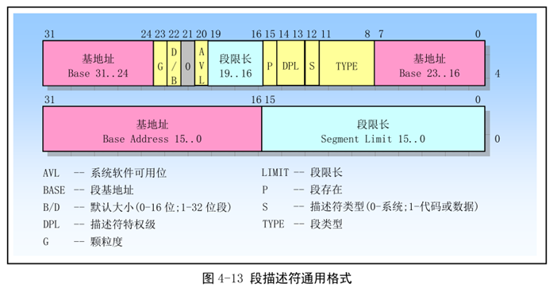

# 段描述符的通用格式
    段描述符是GDT和LDT中的一个数据结构项，用于向处理器提供有关一个段的位置、大小以及访问控制的状态信息。
    每个段描述符的长度是8个字节，含有3个主要字段：

    段基地址
    段限长
    段属性
    段描述符通常由编译器，链接器，加载器或者操作系统来创建，但绝不是应用程序。

下图给出了所有类型的段描述符的一般形式。

    1.段限长字段Limit
    用于指定段的长度。处理器会把段描述符中两个段限长字段组合成一个20位的值，并根据颗粒度标志G来指定段限长Limit值的实际含义。

    如果G=0，则Limit值的单位是B，也就是说Limit的范围可以是1B到1MB；

    如果G=1，则Limit值的单位是4KB，也就是说Limit的范围可以是4KB到4GB。

    根据段类型字段TYPE中的段扩展方向标志E，处理器可以以两种不同的方式使用Limit。

    E=0：表示向上扩展的段（简称上扩段），逻辑地址中的偏移值范围可以从0到Limit；

    E=1：表示向下扩展的段（简称下扩段），逻辑地址中的偏移范围可以从Limit到0xFFFF（当B=0时）或
    者0xFFFF_FFFF（当B=1时）。关于B位，后面将解释。

    2.基地址字段Base
    该字段定义在4GB线性地址空间中一个段的字节0所处的位置。也许你觉得这句话不好理解，我们换一种说法：对于一个
    逻辑地址，如果段内偏移为0，那么这个逻辑地址对应的线性地址就是Base；如果段内偏移为X，那么这个逻辑地址对应
    的线性地址就是Base+X；

    段基地址可以是0~4GB范围内的任意地址（这同实模式不同，实模式下段基地址要求16字节对齐），但是，为了让程序
    具有最佳性能，还是建议段基地址对齐16字节边界。

    3.段类型字段TYPE
    该字段用于指定段或者门（Gate）的类型、说明段的访问种类以及段的扩展方向。该字段的解释依赖于描述符类型标
    志S；TYPE字段的编码对代码段、数据段或者系统描述符都不同。

    4.描述符类型标志S
    S=0：表示存储段描述符。所谓“存储段”，就是存放可由程序直接进行访问的代码和数据的段。说白了，存储段就是代
    码段或者数据段。

    S=1：表示系统描述符。

    5.描述符特权级字段DPL
    用于指明描述符的特权级。特权级范围从0（最高）到3（最低）。DPL字段用于控制对段的访问。

    6.段存在标志P
    用于指出一个段是在内存中（P=1）还是不在内存中（P=0）.

    7.D/B（默认操作数大小/默认栈指针大小和上界限）
    对于代码段，此位称为“D”位；对于栈段，此位称为“B”位。我们在后文会说。

    8.颗粒度标志G
    该字段用于确定段限长字段Limit值的单位。

    如果G=0，则Limit值的单位是B；

    如果G=1，则Limit值的单位是4KB；

    注意：这个字段不影响段基地址的颗粒度，基地址的颗粒度总是以字节为单位。

    9.可用和保留位
    L位（就是上图灰色的那个位）：是64位代码段标志，保留此位给64位处理器使用。目前，我们将此位置“0”即可。

    AVL：是软件可以使用的位，通常由操作系统来用，处理器并不使用它。

# 数据段描述符

当S=1且TYPE字段的最高位（第2个双字的位11）为0时，表明是一个数据段描述符。

下图是数据段描述符的格式。

    1.B位（默认栈指针大小和上界限）
    对于栈段（由SS寄存器指向的数据段）来说，该位用来指明隐含堆栈操作（如PUSH、POP或CALL）时的栈指针大小。

    B=0：使用SP寄存器

    B=1：使用ESP寄存器

    同时，B的值也决定了栈的上部边界。

    B=0：栈段的上部边界（也就是SP寄存器的最大值）为0xFFFF;

    B=1：栈段的上部边界（也就是ESP寄存器的最大值）为0xFFFF_FFFF.

    2.A位（已访问）
    用于表示一个段最近是否被访问过（准确地说是指明从上次操作系统清零该位后一个段是否被访问过）。

    当创建描述符的时候，应该把这位清零。之后，每当该段被访问时（准确地说是处理器把这个段的段选择符加载进段寄
    存器时，也许你不懂这句话，没有关系，现在忽略就可以了。）它就会将该位置“1”；对该位的清零是由操作系统负责的
    ，通过定期监视该位的状态，就可以统计出该段的使用频率。当内存空间紧张时，可以把不经常使用的段退避到硬盘上
    ，从而实现虚拟内存管理。

    3.W位（可写）
    指示段的读写属性。

    W=0：段不允许写入，否则会引发处理器异常中断；

    W=1：允许写入。

    4.E位（扩展方向）
    E=0：表示向上扩展的段（简称上扩段），逻辑地址中的偏移值范围可以从0到Limit；

    E=1：表示向下扩展的段（简称下扩段，通常是栈段），逻辑地址中的偏移范围可以从Limit到0xFFFF（当B=0时）或
    者0xFFFF_FFFF（当B=1时）。

# 代码段描述符
当S=1且TYPE字段的最高位（第2个双字的位11）为1时，表明是一个代码段描述符。

下图是代码段描述符的格式。

    1.D位（默认操作数大小）
    用于指出该段中的指令引用有效地址和操作数的默认长度。

    D=0：默认值是16位的地址和16位或者8位的操作数；

    D=1：默认值是32位的地址和32位或者8位的操作数；

    说明：指令前缀0x66可以用来选择非默认值的操作数大小，指令前缀0x67可以用来选择非默认值的地址大小。

    2.A位（已访问）
    与数据段描述符中的A位相同。

    3.R位（可读）
    R=0：代码段不可读，只能执行。

    R=1：代码段可读，可执行。

    也许有人会问，当R=0时，既然代码段不可读，那处理器怎么从里面取指令执行呢？事实上，这里的R属性并非针对处理器，而是用来限制程序的行为。当常数或者静态数据被放在了一个ROM中时，就可以使用一个可读可执行的代码段，然后通过使用带CS前缀的指令，就可以读取代码段中的数据。

    注意：

    在保护模式下，代码段是不可写的。
    堆栈段必须是可读可写的数据段。
    4.C位（一致性）
    C=0：表示非一致性代码段。这样的代码段可以被同级代码段调用，或者通过门调用；

    C=1：表示一致性代码段。可以从低特权级的程序转移到该段执行（但是低特权级的程序仍然保持自身的特权级）。

    注意：所有的数据段都是非一致性的，即意味着它们不能被低特权级的程序或过程访问。然而与代码段不同，数据段可以被更高特权级的程序或过程访问，而无需使用特殊的访问门。
