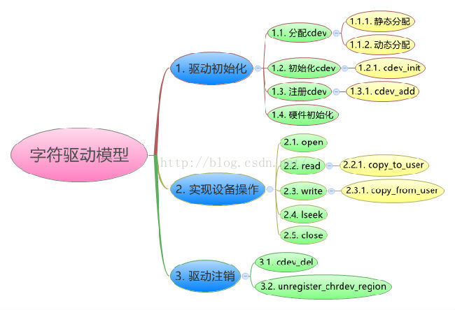

# 字符设备

    在Linux内核中，使用cdev结构体来描述一个字符设备，cdev结构体的定义如下：

    <include/linux/cdev.h>

    struct cdev {
    	struct kobject kobj;                  //内嵌的内核对象.
    	struct module *owner;                 //该字符设备所在的内核模块的对象指针.
    	const struct file_operations *ops;    //该结构描述了字符设备所能实现的方法，是极为关键的一个结构体.
    	struct list_head list;                //用来将已经向内核注册的所有字符设备形成链表.
    	dev_t dev;                            //字符设备的设备号，由主设备号和次设备号构成.
    	unsigned int count;                   //隶属于同一主设备号的次设备号的个数.
    };

    内核给出的操作struct cdev结构的接口主要有以下几个:

    对该结构体进行初始化主要使用函数1和2

    1. void cdev_init(struct cdev *, const struct file_operations *);
    该函数主要对struct cdev结构体做初始化，最重要的就是建立cdev 和 file_operations之间的连接：

    源码为：
    void cdev_init(struct cdev *cdev, const struct file_operations *fops)
    {
    	memset(cdev, 0, sizeof *cdev);
    	INIT_LIST_HEAD(&cdev->list);
    	kobject_init(&cdev->kobj, &ktype_cdev_default);
    	cdev->ops = fops;
    }

    (1) 将整个结构体清零；
    (2) 初始化list成员使其指向自身；
    (3) 初始化kobj成员；
    (4) 初始化ops成员；

    2. struct cdev *cdev_alloc(void);
    该函数主要分配一个struct cdev结构，动态申请一个cdev内存，并做了cdev_init中所做的前
    3步初始化工作(第四步初始化工作需要在调用cdev_alloc后，显式的做初始化即: .ops=xxx_ops).

     源码为：
     struct cdev *cdev_alloc(void)
     {
      	struct cdev *p = kzalloc(sizeof(struct cdev), GFP_KERNEL);
      	if (p) {
      		INIT_LIST_HEAD(&p->list);
      		kobject_init(&p->kobj, &ktype_cdev_dynamic);
      	}
      	return p;
      }

      3. int cdev_add(struct cdev *p, dev_t dev, unsigned count);
      该函数向内核注册一个struct cdev结构，即正式通知内核由struct cdev *p代表的字符设备已经可以使用了。

      当然这里还需提供两个参数：
      (1)第一个设备号 dev，
      (2)和该设备关联的设备编号的数量。
      这两个参数直接赋值给struct cdev 的dev成员和count成员。

      4. void cdev_del(struct cdev *p)；
     该函数向内核注销一个struct cdev结构，即正式通知内核由struct cdev *p代表的字符设备已经不可以使用了。
     从上述的接口讨论中，我们发现对于struct cdev的初始化和注册的过程中，我们需要提供几个东西

     (1) struct file_operations结构指针；
     (2) dev设备号；
     (3) count次设备号个数。
